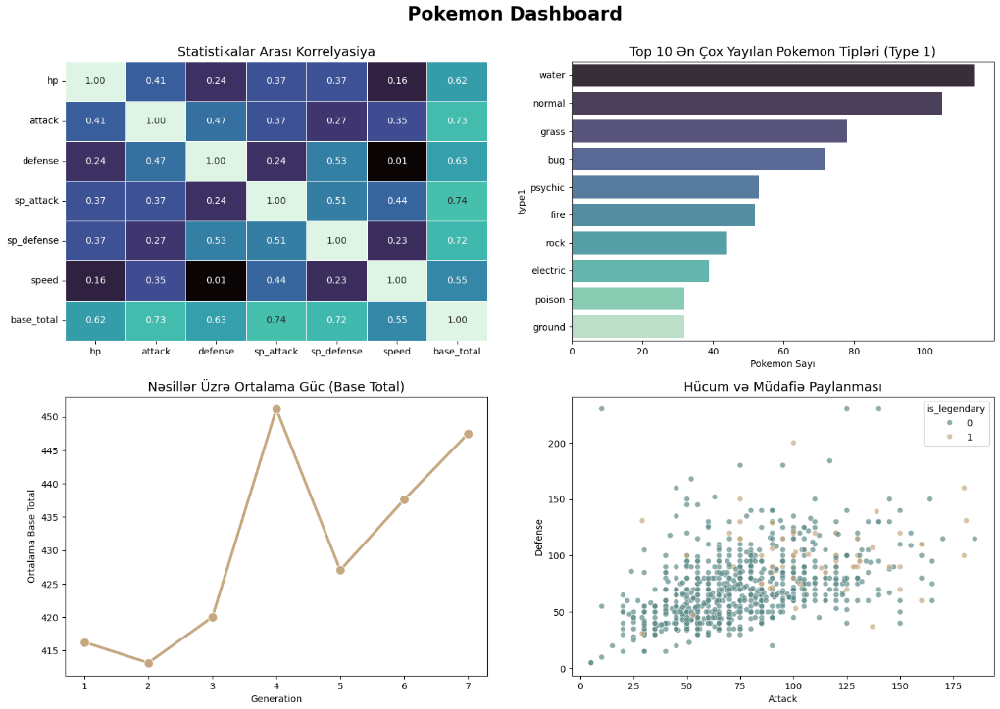
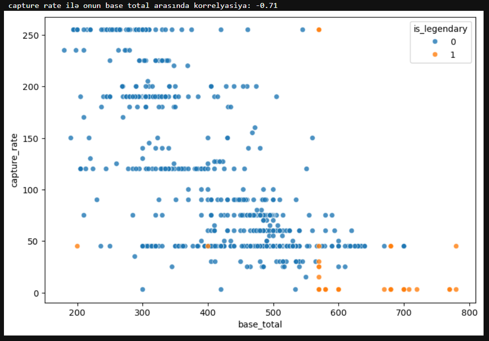
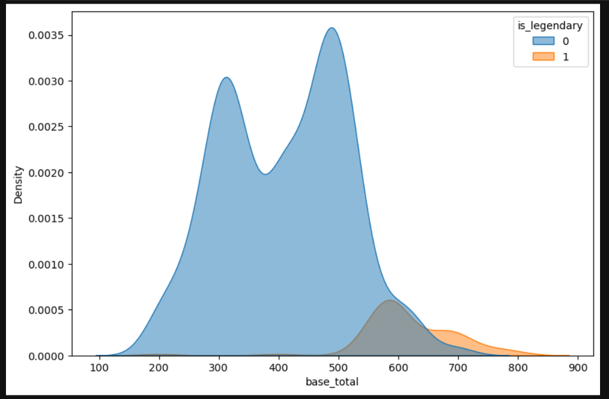
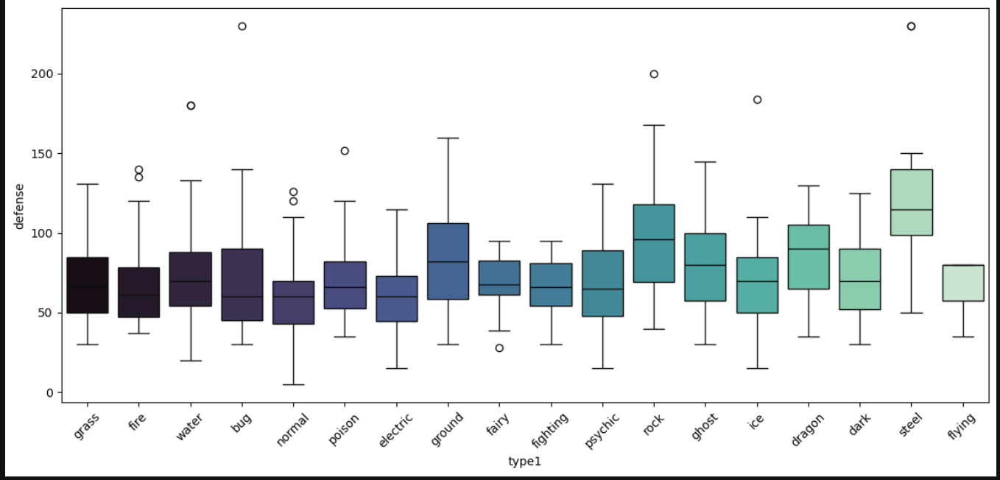

# 🔮 Pokemon Data Analysis 🐾

---

## ✦ The Concept

This project takes a deep dive into the Pokemon universe through the lens of data. Using Python's powerful data manipulation and visualization libraries, we uncover patterns in base stats, type distributions, and legendary characteristics. 

## ✦ Project Structure

* **`pokemon_analysis.ipynb`**: The core Jupyter Notebook containing all the code, from data cleaning to advanced visualizations.
* **`data/Pokemon.xlsx`**: The raw dataset containing all physical and combat attributes of the Pokemon.

## ✦ Key Insights & Workflow

1. **Data Cleaning & Preprocessing**: Handling missing values, standardizing column names, and ensuring correct data types for accurate analysis.
2. **Exploratory Data Analysis (EDA)**: 
   * Distribution and frequency of primary and secondary Pokemon types.
   * Statistical correlation between physical attributes (Attack, Defense, Speed, HP).
   * Generational power scaling and Legendary Pokemon analysis.
3. **Visual Aesthetics**: Leveraging custom, dark-themed, and purple-heavy color palettes in Seaborn and Matplotlib to create editorial-quality charts and graphs.

---

## ✦ Visualizations

A glimpse into the aesthetic and analytical data visualizations created during this project:

### 📊 Pokemon Dashboard
An overarching view of statistical correlations, type frequencies, and generation power scaling.

### 📈 In-Depth Metrics

**Capture Rate vs. Base Total**
A scatter plot demonstrating the negative correlation between a Pokemon's power and its catchability.

**Base Total Density (Legendary vs. Non-Legendary)**
Density estimation highlighting the significant power gap between legendary and regular Pokemon.

**Defense Distribution by Primary Type**
A boxplot analysis revealing the defense capabilities across different Pokemon elements.

---
*Crafted with data-driven precision.* 🐈‍⬛✨
